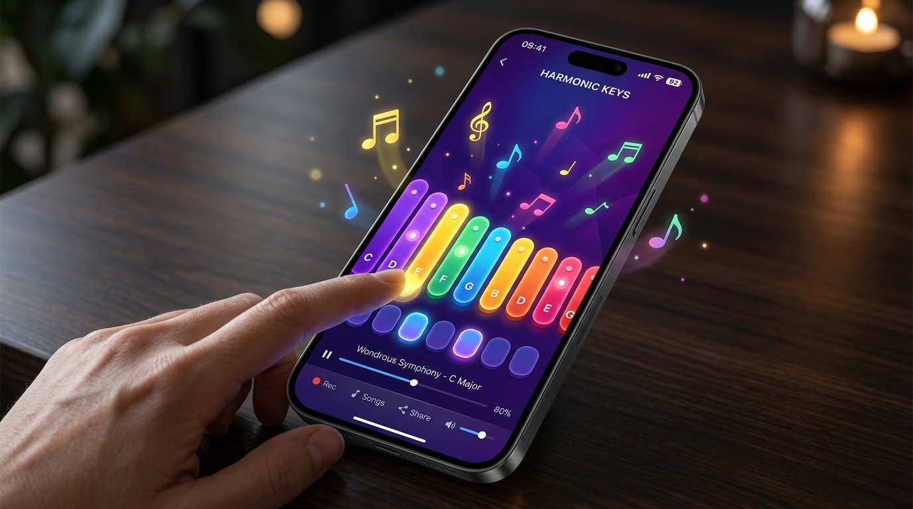

# 🎶 Pocket Xylophone

<div align="center">


<p align="center">
  <strong>An interactive, ultra-responsive musical xylophone application built with Flutter & Dart.</strong>
</p>

<!-- Platform Demo Preview Mockup -->
<p align="center">
  
</p>

</div>

---

## ✨ Features

- 🌈 **7 Tuned Harmonic Notes**: Complete musical octave with rich, crisp sound samples (`assets_note1.wav` through `assets_note7.wav`).
- 🔀 **Triple Notation Switcher**:
  - **Letters** (`C`, `D`, `E`, `F`, `G`, `A`, `B`)
  - **Solfège** (`Do`, `Re`, `Mi`, `Fa`, `Sol`, `La`, `Ti`)
  - **Numbers** (`1`, `2`, `3`, `4`, `5`, `6`, `7`)
- 📖 **Interactive Songbook & Auto-Demo**:
  - Includes sheet music for **Twinkle Twinkle Little Star**, **Happy Birthday**, **Mary Had a Little Lamb**, **Jingle Bells**, and **Ode to Joy**.
  - Hit **Play Demo** to watch the app play melodies in real-time with synchronized visual key highlights!
- ⚡ **Zero-Latency Audio Engine**: Pre-configured low-latency audio player pool for instant response on rapid taps without audio clipping.
- 🎨 **Authentic Tactile Design**:
  - Graduated physical key bar sizing mimicking real xylophones.
  - Realistic chrome acoustic mounting grommets.
  - Smooth spring scale animations and glowing visual feedback upon strike.
  - Integrated haptic feedback.
- 🎧 **Lo-Fi Adventure Time Aesthetic**: Features chill Jake-listening-to-tunes artwork banner with smooth gradient overlays.
- 🔇 **Mute / Sound Toggle**: Quick-access sound control right in the top navigation bar.

---

## 📸 Platform Demo

The app brings vibrant musical tactile feedback to both mobile and desktop screens:

```
┌──────────────────────────────────────────────┐
│  🎹 Pocket Xylophone          [C-D-E] [📖] 🔊 │
├──────────────────────────────────────────────┤
│  [ 🎧 Jake Chill Beats Banner              ] │
├──────────────────────────────────────────────┤
│  ══════════════ [ C  -  Do ] ══════════════  │  (Red)
│   ═════════════ [ D  -  Re ] ═════════════   │  (Orange)
│    ════════════ [ E  -  Mi ] ════════════    │  (Yellow)
│     ═══════════ [ F  -  Fa ] ═══════════     │  (Green)
│      ══════════ [ G  - Sol ] ══════════      │  (Cyan)
│       ═════════ [ A  -  La ] ═════════       │  (Blue)
│        ════════ [ B  -  Ti ] ════════        │  (Violet)
└──────────────────────────────────────────────┘
```

---

## 🚀 Getting Started

### Prerequisites

- [Flutter SDK](https://flutter.dev/docs/get-started/install) (v3.5.4 or higher)
- [Dart SDK](https://dart.dev/get-dart) (^3.5.4)

### Installation

1. **Clone the repository:**
   ```bash
   git clone git@github.com:YeamimHossainSajid/xylophone.git
   cd xylophone
   ```

2. **Install dependencies:**
   ```bash
   flutter pub get
   ```

3. **Run the app:**
   ```bash
   flutter run
   ```

---

## 📁 Project Structure

```text
xylophone/
├── assets/                    # Audio WAV notes, artwork, and demo preview
│   ├── assets_note1.wav ... assets_note7.wav
│   ├── aa.jpg                 # Jake artwork banner
│   └── demo.jpg               # Platform mockup preview
├── lib/
│   ├── models/
│   │   ├── song.dart          # Melodies and song sequences
│   │   └── xylophone_note.dart# Note definitions, colors & ratios
│   ├── services/
│   │   └── audio_service.dart # Low-latency AudioPlayer pool
│   ├── widgets/
│   │   ├── song_sheet_dialog.dart # Songbook modal
│   │   └── xylophone_key.dart # Tactile animated key bar
│   └── main.dart              # App entry point & theme
├── .gitattributes             # GitHub Linguist 100% Dart config
├── pubspec.yaml               # Project dependencies
└── README.md
```

---

## 📊 GitHub Language Stats (100% Dart)

This repository includes a configured `.gitattributes` file using **GitHub Linguist** overrides. Boilerplate platform directories (`android/`, `ios/`, `windows/`, `linux/`, `macos/`, `web/`) are marked as `linguist-vendored`, ensuring GitHub language analytics (and tracker platforms like **gitfut**) accurately recognize this project as **100% Dart**.

---

## 📜 License

This project is open-source under the [MIT License](LICENSE). Feel free to modify and play your own tunes!
